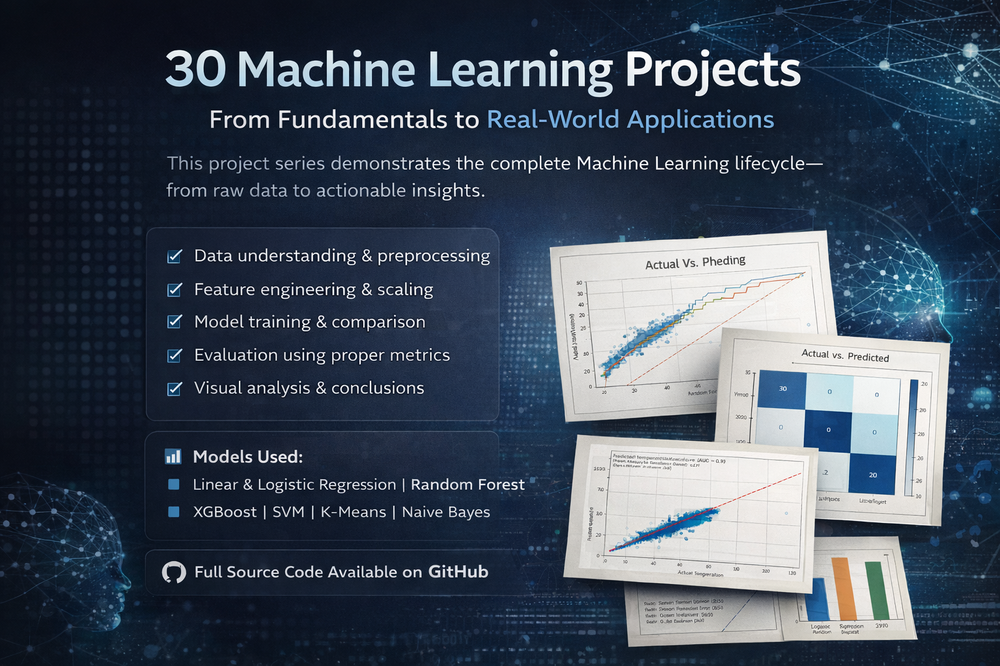
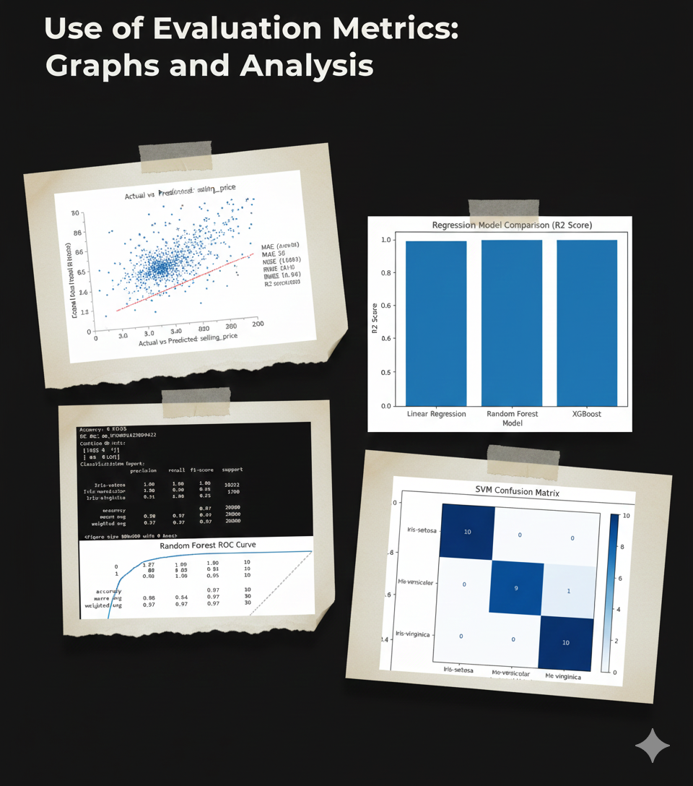
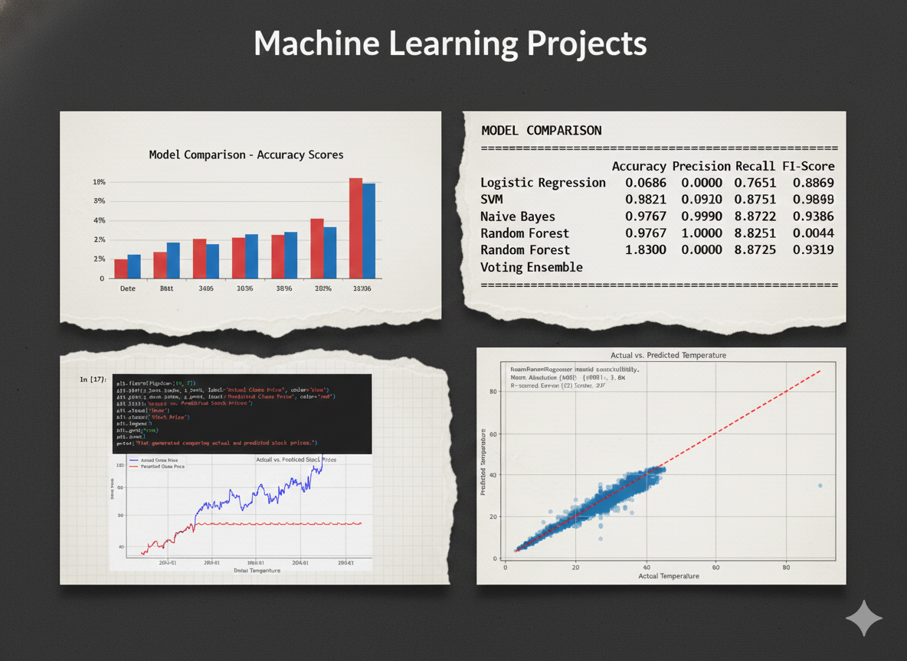
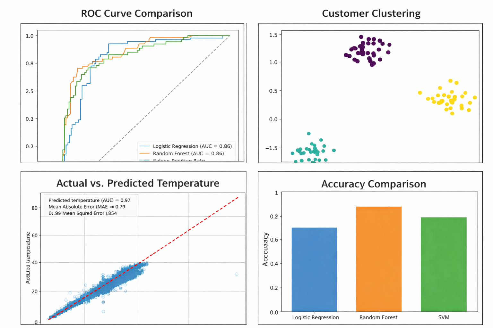

# 🚀 30 Machine Learning Projects – From Beginner to Advanced

A curated collection of **30 end-to-end Machine Learning projects** covering **Regression, Classification, Clustering, NLP, Time Series, and Ensemble methods**.  

---
<p align="center">
  
  
</p>

<p align="center">
  
  
</p>

## 📌 Table of Contents

- [Overview](#-overview)
- [Project Structure](#-project-structure)
- [Projects List](#-projects-list)
- [Technologies Used](#-technologies-used)
- [Installation](#-installation)
- [How to Use](#-how-to-use)
- [Contributing](#-contributing)

---

## 🔍 Overview

This repository contains **30 practical ML projects** designed to help you:

✔ Understand ML algorithms with real datasets  
✔ Learn data preprocessing, visualization & modeling  
✔ Build hands-on experience for jobs & internships  
✔ Strengthen ML & Data Science fundamentals  

---

## 📂 Project Structure

```
30-Machine-Learning-Projects
│
├── A-Regression Projects(1-7)
├── B-Classification Projects(8-13)
├── C-Clustering Projects(14-16)
├── D-Association Rule Mining(17-18)
├── E-Ensemble Methods(19-23)
├── F-Natural Language Processing(24-27)
└── G-Time_Series(28-30)
```

---

## 📊 Projects List

| S.No | Project Name | Link |
|-----|-------------|------|
| 1 | House Price Prediction | [click here](https://github.com/ash-iiiiish/30-Machine-Learning-Projects/blob/main/A-Regression%20Projects(1-7)/1.House%20Price%20Prediction/house%20price%20prediction.ipynb) |
| 2 | Car Price Prediction | [click here](https://github.com/ash-iiiiish/30-Machine-Learning-Projects/blob/main/A-Regression%20Projects(1-7)/2.Car%20Price%20Prediction/car%20price%20prediction.ipynb) |
| 3 | Student Score Prediction | [click here](https://github.com/ash-iiiiish/30-Machine-Learning-Projects/blob/main/A-Regression%20Projects(1-7)/3.Student%20Score%20Prediction/student%20score%20prediction.ipynb) |
| 4 | Salary Prediction | [click here](https://github.com/ash-iiiiish/30-Machine-Learning-Projects/blob/main/A-Regression%20Projects(1-7)/4.Salary%20Prediction/salary%20prediction.ipynb) |
| 5 | Sales Forecasting | [click here](https://github.com/ash-iiiiish/30-Machine-Learning-Projects/blob/main/A-Regression%20Projects(1-7)/5.Sales%20Forecasting/sales%20forecasting.ipynb) |
| 6 | Gold Price Prediction | [click here](https://github.com/ash-iiiiish/30-Machine-Learning-Projects/blob/main/A-Regression%20Projects(1-7)/6.Gold%20Price%20Prediction/gold%20price%20prediction.ipynb) |
| 7 | Medical Insurance Cost Prediction | [click here](https://github.com/ash-iiiiish/30-Machine-Learning-Projects/blob/main/A-Regression%20Projects(1-7)/7.Medical%20Insurance%20Cost%20Prediction/medical%20insurance%20cost%20prediction.ipynb) |
| 8 | Breast Cancer Detection | [click here](https://github.com/ash-iiiiish/30-Machine-Learning-Projects/blob/main/B-%20Classification%20Projects(8-13)/8.Breast%20Cancer%20Detection/breast%20cancer%20detection.ipynb) |
| 9 | Email Spam Detection | [click here](https://github.com/ash-iiiiish/30-Machine-Learning-Projects/blob/main/B-%20Classification%20Projects(8-13)/9.Email%20Spam%20Detection/email%20spam%20detection.ipynb) |
| 10 | Diabetes Prediction | [click here](https://github.com/ash-iiiiish/30-Machine-Learning-Projects/blob/main/B-%20Classification%20Projects(8-13)/10.Diabetes%20Prediction/diabetes%20prediction.ipynb) |
| 11 | Custoer Churm Prediction | [click here](https://github.com/ash-iiiiish/30-Machine-Learning-Projects/blob/main/B-%20Classification%20Projects(8-13)/11.Customer%20Churm%20Prediction/customer%20churm%20prediction.ipynb) |
| 12 | Iris Flower Classification | [click here](https://github.com/ash-iiiiish/30-Machine-Learning-Projects/blob/main/B-%20Classification%20Projects(8-13)/12.Iris%20Flower%20Classification/iris%20flower%20classification.ipynb) |
| 13 | Titanic Survival Prediction | [click here](https://github.com/ash-iiiiish/30-Machine-Learning-Projects/blob/main/B-%20Classification%20Projects(8-13)/13.TItanic%20Survival%20Prediction/titanic%20survival%20prediction.ipynb) |
| 14 | Customer Segmentation | [click here](https://github.com/ash-iiiiish/30-Machine-Learning-Projects/blob/main/C-Clustering%20Projects(14-16)/14.Customer%20Segmentation/customer%20segmentation.ipynb) |
| 15 | Mall Customers Segmentation | [click here](https://github.com/ash-iiiiish/30-Machine-Learning-Projects/blob/main/C-Clustering%20Projects(14-16)/15.Mall%20Customers%20Segmentation/mall%20customer%20segmentation.ipynb) |
| 16 | Spotify Songs Clustering | [click here](https://github.com/ash-iiiiish/30-Machine-Learning-Projects/blob/main/C-Clustering%20Projects(14-16)/16.Spotify%20Songs%20Clustering/Spotify%20Songs%20Clustering.ipynb) |
| 17 | Market Basket Analysis(Apriori) | [click here](https://github.com/ash-iiiiish/30-Machine-Learning-Projects/blob/main/D-Association%20Rule%20Mining(17-18)/17.Market%20Basket%20Analysis(Apriori)/market%20basket%20analysis.ipynb) |
| 18 | Movie Pair Recommendation | [click here](https://github.com/ash-iiiiish/30-Machine-Learning-Projects/blob/main/D-Association%20Rule%20Mining(17-18)/18.Movie%20Pair%20Recommendation/movie%20pair%20recommendation.ipynb) |
| 19 | Customer Churm Ensemble Model | [click here](https://github.com/ash-iiiiish/30-Machine-Learning-Projects/blob/main/E-Ensemble%20Methods(19-23)/19.Customer%20Churn%20Ensemble%20Model/customer%20churn%20ensemble.ipynb) |
| 20 | House Price Ensemble Model | [click here](https://github.com/ash-iiiiish/30-Machine-Learning-Projects/blob/main/E-Ensemble%20Methods(19-23)/20.House%20Price%20Ensemble%20Model/house%20price%20ensemble.ipynb) |
| 21 | Voting Classifier on Iris Dataset | [click here](https://github.com/ash-iiiiish/30-Machine-Learning-Projects/blob/main/E-Ensemble%20Methods(19-23)/21.Voting%20Classifier%20on%20Iris%20Dataset/voting%20classifier%20on%20iris%20dataset.ipynb) |
| 22 | Spam Detection Using Ensembles | [click here](https://github.com/ash-iiiiish/30-Machine-Learning-Projects/blob/main/E-Ensemble%20Methods(19-23)/22.Spam%20Detection%20Using%20Ensembles/spam%20detection%20using%20ensembles.ipynb) |
| 23 | Fraud Detection Using Ensembles | [click here](https://github.com/ash-iiiiish/30-Machine-Learning-Projects/blob/main/E-Ensemble%20Methods(19-23)/23.Fraud%20Detection%20Using%20Ensembles/fraud%20detection%20using%20ensembles.ipynb) |
| 24 | Sentiment Analysis | [click here](https://github.com/ash-iiiiish/30-Machine-Learning-Projects/blob/main/F-Natural%20Language%20Processing(24-27)/24.Sentiment%20Analysis/sentiment%20analysis.ipynb) |
| 25 | Fake News Detection | [click here](https://github.com/ash-iiiiish/30-Machine-Learning-Projects/blob/main/F-Natural%20Language%20Processing(24-27)/25.Fake%20News%20Detection/fake%20news%20detection.ipynb) |
| 26 | Resume Classification | [click here](https://github.com/ash-iiiiish/30-Machine-Learning-Projects/blob/main/F-Natural%20Language%20Processing(24-27)/26.Resume%20Classification/resume%20classification.ipynb) |
| 27 | Text Classification(News_Dataset) | [click here](https://github.com/ash-iiiiish/30-Machine-Learning-Projects/blob/main/F-Natural%20Language%20Processing(24-27)/27.Text%20Classification(News_Dataset)/text%20classification%20on%20news%20dataset.ipynb) |
| 28 | Daily Temperature Prediction | [click here](https://github.com/ash-iiiiish/30-Machine-Learning-Projects/blob/main/G-Time_Series(28-30)/28.Daily%20Temperature%20Prediction/daily%20temperature%20prediction.ipynb) |
| 29 | Weather Forecasting | [click here](https://github.com/ash-iiiiish/30-Machine-Learning-Projects/blob/main/G-Time_Series(28-30)/29.Weather%20Forecasting/weather%20forecasting.ipynb) |
| 30 | Stock Price Trend Prediction | [click here](https://github.com/ash-iiiiish/30-Machine-Learning-Projects/blob/main/G-Time_Series(28-30)/30.Stock%20Price%20Trend%20Prediction/stock%20price%20trend%20prediction.ipynb) |

---

## 🛠 Technologies Used

- Python
- NumPy
- Pandas
- Matplotlib & Seaborn
- XGBoost
- Ensemble Learning
- Scikit-Learn
- NLP Libraries
- Jupyter Notebook
- Hypertuning & Optimization Techniques

---

## ⚙️ Installation

```bash
git clone https://github.com/ash-iiiiish/30-Machine-Learning-Projects
cd 30-Machine-Learning-Projects
pip install -r requirements.txt
```

---

## ▶️ How to Use

1. Navigate to any project folder  
2. Open the Jupyter Notebook  
3. Run cells step-by-step  

---


## 👨‍💻 Contributors
- [@ash-iiiiish](https://github.com/ash-iiiiish)


## 🤝 Contributing
Contributions are welcome! Fork this repository and submit a pull request.
